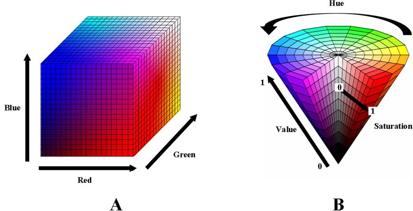
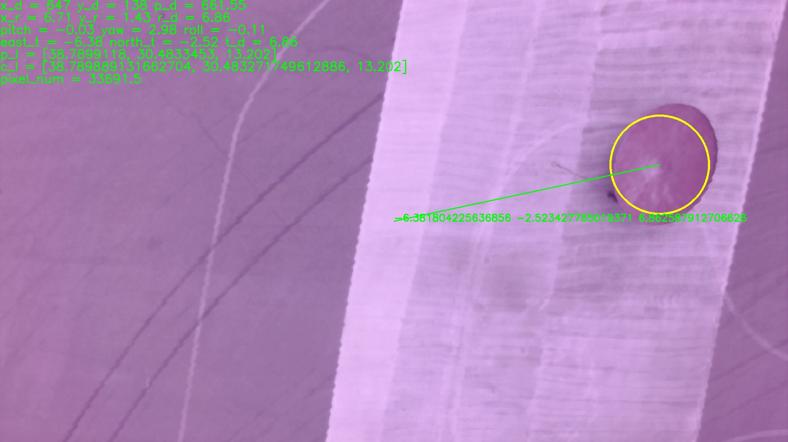
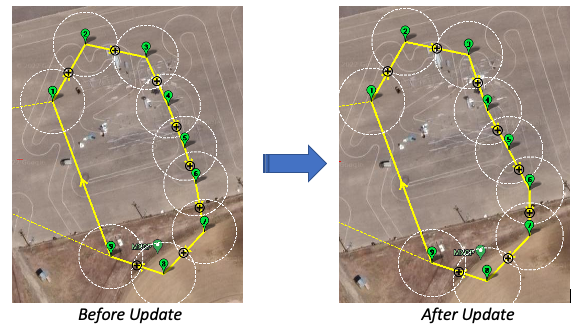

# UAV Mission Updater

## Main Purpose

This repository is created for Teknofest 2022 International UAV competition. The main purpose is to detect a red circular area with a radius of 1.25 meters from a minimum of 5 meters height. After identifying the coordinates of the target, a ball should be released at the correct time to hit the target. Since our purpose is to achieve this in AUTO mode, we need an automatic mission updating purpose in MissionPlanner, which was done with Python.

An image taken during the flight of the UAV

---

## Hardware and Peripherals:

- *Pixhawk the Cube Orange (Autopilot Board)*
- *Raspberry PI 4 - 4GB (Companion Computer)*
- *Logitech C920 Webcam (Camera)*

## Software and Platforms:

- *Ardupilot - Stable 4.2.2 (Autopilot Software)*
- *MissionPlanner - 2.0 (Ground Station Software)*
- *Python - 3.9.2 (Language)*
- *OpenCV - 4.5.2 (Image Processing)*
- *DroneKit - 2.9.2 (Guiding the Autopilot)*

---

## Target Detection

**HSV Filtering:** For color detection, HSV filtering applied. In the figure below, one can see how RGB to HSV conversion done. For tuning, many test flights have been done.

RGB to HSV conversion

## Coordinate Determination

For the determination of coordinates of the target, global relative frame has been used. The calculations can be observed in **<plane_functions.py>.** The mainly used module for this process is DroneKit-Python. By usage of this module, we calculated the distance between the coordinates of the UAV and the target detected with OpenCV module.

Coordinate calculations photo from Teknofest competition.

## Mission Updating

In mission updating, MissionPlanner interface has been used. By dronekit mission download and upload functions, we can change the route of our plane with the new coordinates of the target calculated in the first lap in the competition

